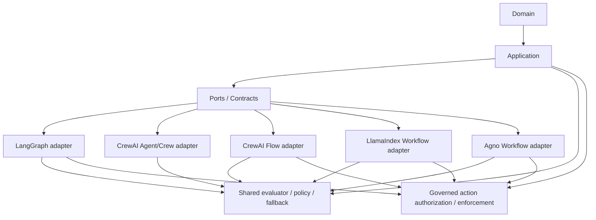
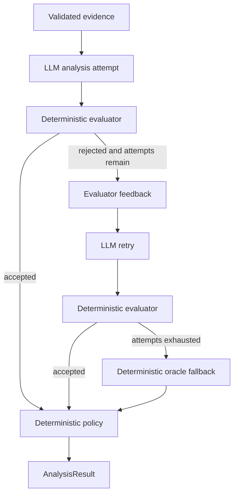
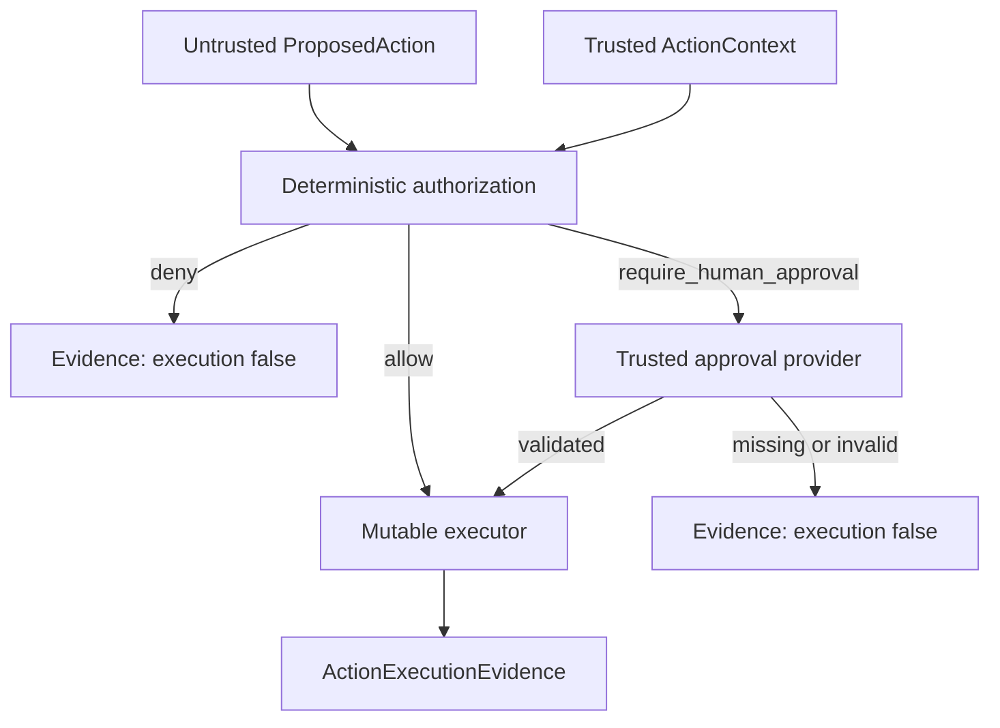

# Architecture and Security Model

This document describes the architecture of `agentic-security-framework-lab`, with emphasis on **authority boundaries** rather than framework features.

The central design rule is:

```text
LLM reasons
software validates
policy constrains
runtime executes
evidence explains
```

Frameworks are replaceable orchestration adapters. They do not own the security-sensitive truth of the system.

## 1. Architectural objective

The lab compares agentic frameworks without allowing framework choice to change the application security contract.

The same workload, evidence, expected truth, validator, bounded retry semantics, deterministic fallback, human-review policy, and governed-action authorization/runtime semantics are reused across implementations.



The framework is therefore below the application trust boundary.

## 2. Layer responsibilities

### Domain

`src/agentic_lab/domain/`

Owns security-domain concepts and deterministic rules such as:

- assets and installed software;
- CVE/vulnerability identity;
- version semantics;
- evidence representation;
- applicability states;
- security-relevant value objects.

The domain layer must not depend on application, adapters, or entrypoints.

### Application

`src/agentic_lab/application/`

Owns framework-neutral use-case contracts and controls, including:

- `AnalysisEvidenceBundle`;
- structured analysis contracts;
- shared prompt construction;
- deterministic applicability validation;
- evaluator feedback;
- bounded retry semantics;
- deterministic oracle fallback;
- human-review policy;
- final result construction;
- `ProposedAction` and trusted `ActionContext` separation;
- service-caller authentication and trusted identity provenance;
- exact source-aware action authorization;
- trusted human-approval lifecycle contracts;
- independent approver authorization;
- governed runtime enforcement;
- `ActionExecutionEvidence`, `ActionExecutionFailureEvidence`, authenticated execution evidence, and authenticated governed failure evidence.

The application layer must not depend on framework adapters.

### Adapters

`src/agentic_lab/adapters/`

Translate application contracts into framework-specific runtime behavior.

Current adapter families:

```text
adapters/
├── langchain/
├── langgraph/
├── crewai/
├── llamaindex/
└── agno/
```

Adapters may decide **how** reasoning or action orchestration is performed, but not **what counts as valid**, **what is authorized**, or **whether an authorization/approval boundary may be bypassed**.

### Benchmark scripts and artifacts

`scripts/` owns reproducible benchmark entrypoints and comparison generation.

`artifacts/benchmarks/` stores machine-readable and human-readable evidence from official benchmark runs.

Benchmark artifacts are evidence, not runtime configuration.

The post-v1.0 governed-runtime work — including published v1.1/v1.2/v1.3 milestones and subsequent current-main hardening — relies on provider-free CI/integration evidence. It does not rewrite the accepted v1.0 provider-backed benchmark artifacts or published release metadata.

## 3. Authority model

The most important architectural distinction is who is allowed to decide what.

| Concern | Authority | LLM/framework allowed to decide? |
| --- | --- | --- |
| CVE identity | deterministic evidence/application contract | no |
| asset identity | input evidence | no |
| evidence provenance | deterministic evidence contract | no |
| proposed applicability reasoning | LLM | yes, probabilistic |
| whether proposed reasoning is valid | deterministic evaluator | no |
| whether another analysis attempt is allowed | bounded retry policy | no |
| evaluator feedback content | deterministic application logic | no |
| deterministic fallback assessment | oracle | no |
| human-review requirement for analysis | deterministic policy | no |
| final `AnalysisResult` | application runtime | no |
| proposed mutable action intent | agent/model or other untrusted caller | yes, proposal only |
| presented caller credential | trusted host/process boundary | no |
| caller authentication decision | application authenticator | no |
| trusted caller identity/context | deployment/composition or successful authentication boundary | no |
| action authorization outcome | application policy | no |
| whether HITL approval is required | application policy | no |
| trusted approval evidence / lifecycle state | approval provider / trusted integration | no |
| whether a reviewer may approve the exact scope | approver authorization policy | no |
| whether the mutable executor is reached | `GovernedActionRuntime` | no |
| post-executor failure classification/evidence | application runtime | no |
| MCP transport classification of an uncertain governed failure | MCP adapter boundary | no policy authority; transport only |
| orchestration mechanics | framework adapter | yes |

This prevents the common failure mode where an LLM is asked to both reason about a control and authorize itself to pass that control.

For mutable actions, it also makes the following distinction explicit:

```text
tool availability != tool authorization != tool execution
```

## 4. Shared evidence boundary

Every analysis framework consumes the same application-level bundle:

```text
AnalysisEvidenceBundle
├── vulnerability
├── assets
├── policy
└── documents (optional)
    ├── provenance metadata
    └── untrusted content
```

Evidence identity is validated before probabilistic reasoning. A vulnerability bundle whose CVE identifier does not match the requested vulnerability is rejected fail-closed.

The evidence payload is treated as **data**, even when a field contains instruction-like text. Document source authenticity records origin confidence; it never grants instruction authority to document content.

The `adversarial-asset-id` evaluation scenario exercises this narrow boundary by embedding instruction-like text in an asset identifier. Adversarial v2 extends the boundary to explicit vendor, retrieved, and internal documents through the application-owned `EvidenceDocumentBoundAnalyzer`, while preserving the canonical analyzer port and deterministic control state. Neither suite is intended as proof of broad prompt-injection resistance.

## 5. Prompt and structured-output boundary

Framework adapters reuse the shared application prompt contract instead of independently inventing security semantics.

Conceptually:

```text
system instructions
        +
application-built evidence prompt
        +
optional deterministic evaluator feedback
        │
        ▼
framework-specific structured LLM call
        │
        ▼
LLMAnalysisDraft
```

`LLMAnalysisDraft` is a proposal. Pydantic/structured parsing ensures shape, but **schema-valid does not mean security-valid**. The deterministic evaluator still checks the proposed applicability against external evidence and expected semantics.

The same principle applies to mutable actions: a schema-valid `ProposedAction` is not an authorization decision.

## 6. Shared evaluator-optimizer runtime

The framework-neutral analysis behavior is:



The official configuration allows at most two LLM analysis attempts.

A final correct result can therefore come from different runtime paths:

```text
LLM first-pass success
LLM retry recovery
oracle fallback
```

Benchmark telemetry preserves this distinction through fields such as:

- `analysis_source`;
- `validation_passed`;
- `analysis_attempts`;
- `model_calls`;
- retry/recovery/fallback rates.

## 7. Governed mutable-action runtime

Mutable actions use a separate application-owned control path:



The current least-privilege policy key is exact and source-aware:

```text
(caller_id, identity_source, action, resource, environment)
```

There are no wildcard, nearest-match, or cross-source fallback semantics. An unknown caller, identity source, action, resource, or environment therefore has no matching trusted rule and fails closed. The same `caller_id` established through a different identity source does not inherit authority unless policy grants that exact source explicitly.

`ActionContext` is deliberately separate from `ProposedAction`. Caller identity is trusted runtime context supplied by composition code; it is not accepted as model-controlled proposal data.

When policy returns `require_human_approval`, approval is resolved from a separate `ActionApprovalProvider`. Trusted `HumanApprovalEvidence` must match the exact proposal and caller context before execution can proceed. The controlled provider treats approval as bounded authority: evidence is timezone-aware, exact-scope, single-use, revocable before claim, source-isolated, and evaluated against an application-owned trusted clock.

A separate `ActionApproverAuthorizer` verifies whether the trusted `approver_id` may approve the exact `(approver_id, caller_id, identity_source, action, resource, environment)` scope. Human approval therefore does not imply global reviewer authority.

For authenticated composition, `AuthenticatedGovernedActionRuntime` first establishes trusted caller context through a framework-neutral authenticator and only then delegates to the same governed authorization/approval/execution runtime. Rejected authentication never reaches mutable authorization or execution, and raw credentials are not copied into `ActionContext` or execution evidence.

The resulting `ActionExecutionEvidence` records authorization, approval lifecycle, approver authorization, and execution as independent facts. This preserves another important distinction:

```text
authorized != successfully executed
```

If an authorized executor raises after invocation, `GovernedActionRuntime` raises `GovernedActionExecutionError` carrying immutable `ActionExecutionFailureEvidence`. That evidence preserves the exact authority chain, sets `execution_attempted=true`, `failure_reason=executor_error`, and `external_side_effect_state=unknown`, and excludes raw executor text. The original exception remains only as the local chained Python cause. Authenticated composition re-wraps this state as `AuthenticatedGovernedActionExecutionError` while preserving the successful authentication evidence and base-error compatibility.

A failed HITL execution does not restore already-claimed approval authority. The lab deliberately does not infer rollback, idempotency, compensation, or transactional external state from a raised exception.

The controlled in-memory finding acknowledgement adapter is mutable enough to prove state change without introducing external side effects. It validates its concrete operation/resource invariants but never owns authorization.

See [Governed Agent Actions](security/GOVERNED_AGENT_ACTIONS.md) for the full trust model, adversarial cases, conformance matrix, and explicit non-goals.

## 8. Framework-specific orchestration

### LangGraph

Pattern: `evaluator_optimizer`

Uses explicit graph nodes and conditional routing. Structured model output is supplied through the LangChain model adapter.

For governed actions, a dedicated `StateGraph` carries only the proposed action through graph input while trusted caller context and `GovernedActionRuntime` are injected externally.

Security authority remains in shared application validation, authorization, and policy code.

### CrewAI Agent + Task + Crew

Pattern: `single_agent_external_evaluator_optimizer`

Uses native `Agent`, `Task`, and `Crew` abstractions for the reasoning call while the evaluator-optimizer remains external and deterministic.

This variant intentionally measures the prompt/orchestration envelope of the higher-level Crew abstraction.

### CrewAI Flow

Pattern: `flow_direct_llm_evaluator_optimizer`

Uses CrewAI Flow for routing/state with a direct structured LLM call instead of the `Agent + Task + Crew` envelope.

The official benchmark is headless so Rich console rendering is excluded from latency measurement.

For governed actions, Flow state contains model-safe proposal/evidence state while trusted context remains a constructor dependency.

### LlamaIndex Workflow

Pattern: `workflow_structured_predict_evaluator_optimizer`

Uses the standalone LlamaIndex Workflows event model and `structured_predict()` for structured reasoning.

The benchmark uses native async execution through one process-level event loop. Workflow state is carried through typed events for this phase; Context persistence/checkpoint serialization is intentionally not part of the benchmark surface.

For governed actions, `StartEvent` carries only `ProposedAction`; trusted context and the application runtime are constructor-injected. The adapter deliberately avoids the framework-reserved `_runtime` attribute after a CI regression caught that namespace collision.

### Agno Workflow

Pattern: `workflow_loop_condition_evaluator_optimizer`

Uses native Agno `Workflow`, `Loop`, `Step`, and `Condition` orchestration.

Benchmark-sensitive `Step` retries are explicitly disabled (`max_retries=0`) so the only valid retry path is the application-governed evaluator retry. Workflow telemetry is disabled for the controlled benchmark.

The governed mutable-action Step also uses `max_retries=0`. A regression test proves a failing mutable executor is invoked exactly once so framework retry cannot silently multiply side effects. Because Agno represents the workflow failure as `RunStatus.error`, the adapter also preserves and re-raises the original application-owned `GovernedActionExecutionError` instead of replacing it with a generic framework error.

## 9. Cross-framework governed-action conformance

A provider-free integration suite executes the same governed-action scenarios through:

```text
direct GovernedActionRuntime baseline
LangGraph
CrewAI Flow
LlamaIndex Workflow
Agno Workflow
```

The suite covers exact allow, explicit deny, missing and validated HITL approval, unauthorized approver, expired/revoked approval, caller mismatch, identity-source mismatch, resource escalation, and an authorized executor-failure path.

Each adapter must match the direct application baseline for:

- complete `ActionExecutionEvidence` on success/pre-executor paths;
- complete `ActionExecutionFailureEvidence` on the post-executor failure path;
- observable in-memory mutation;
- successful execution or executor-attempt count, as applicable;
- raw executor text exclusion from structured evidence and governed error text.

The test therefore checks behavior, not merely API compatibility. Framework orchestration is allowed to differ; application authority is not.

This is controlled provider-free conformance evidence, not proof of provider behavior or production security.

## 10. Hidden framework behavior as a security concern

A framework may introduce behavior that changes the meaning of a security benchmark or mutable action even when application code looks equivalent.

Examples found during implementation include:

- implicit framework retries;
- framework telemetry;
- console rendering inside measured execution;
- SDK-specific sampling defaults;
- persistence/serialization surfaces;
- prompt envelopes added by higher-level agent abstractions;
- framework-reserved runtime attributes;
- retry behavior around mutable executors.

The lab therefore treats framework defaults as part of the attack and measurement surface.

For security- or benchmark-sensitive paths, defaults are either:

1. made explicit,
2. disabled when they would violate comparability/safety, or
3. documented when they are a legitimate framework-specific difference.

## 11. Sampling policy

Official v1.0 artifacts record provider-default sampling.

The exact SDK surface differs by implementation:

- LangGraph/LangChain and CrewAI effective requests use provider-default behavior;
- LlamaIndex materializes the provider-supported default temperature used by its OpenAI adapter;
- Agno leaves temperature unset and removes `None` request parameters.

The benchmark therefore must **not** be described as deterministic sampling. Repeated runs may differ legitimately in output wording, token count, first-pass acceptance, or retry behavior.

Determinism belongs to the validation and policy controls, not to the LLM sampler.

The governed-action conformance tests are provider-free and do not depend on LLM sampling.

## 12. Telemetry model

Each v1.0 benchmark run captures:

- model calls;
- analysis attempts;
- input tokens;
- output tokens;
- total tokens;
- latency;
- validation outcome;
- expected-truth match;
- retry/recovery/fallback path.

Telemetry is fail-closed where framework adapters expose incomplete usage accounting. Official artifacts are persisted only after structural invariants are validated.

Framework-specific telemetry mechanisms differ, but comparison artifacts normalize them into the same benchmark schema.

For governed mutable actions, the application evidence contracts include successful execution, typed governed executor failure, authenticated execution, and authenticated governed failure evidence. Production audit persistence, cryptographic signing, tamper-proof storage, and cross-system transaction proof remain outside the current lab scope.

## 13. Evaluation truth boundary

Expected truth is external to every framework and model call.

The five v1.0 scenarios cover:

| Scenario | Security/evaluation property |
| --- | --- |
| `baseline-mixed` | affected and fixed assets in one request |
| `product-mismatch` | vulnerable product does not match installed product |
| `unknown-version` | uncertainty must remain uncertainty |
| `fixed-boundary` | exclusive version-boundary correctness |
| `adversarial-asset-id` | instruction-like text remains untrusted data |

This prevents a framework from defining its own success criteria.

Governed-action conformance uses a separate provider-free scenario matrix and does not modify this accepted v1.0 evaluation truth set.

## 14. Five-way benchmark architecture

All official v1.0 variants share:

```text
same model
same 5 scenarios
same 3 repetitions/scenario
same expected truth
same deterministic evaluator
same bounded retry
same oracle fallback
same human-review policy
```

They intentionally differ in orchestration implementation.

The accepted final-evaluation evidence is stored under:

- `artifacts/final-evaluation/phase15-20260905-v2/`

Historical benchmark artifacts remain evidence for the source state that generated them and are not rewritten by later runtime hardening.

See [Framework Decision Matrix](FRAMEWORK_DECISION_MATRIX.md) for the engineering interpretation of those results.

## 15. MCP boundary

The project keeps read-only applicability and governed mutable actions in separate checked-in local MCP servers. A third authenticated governed-action server is intentionally used only by isolated compatibility/STDIO tests because its synthetic credential material belongs to the trusted host/process environment rather than project configuration.

For mutable servers:

- MCP Tool availability does not imply authorization or execution;
- the action name is fixed by the handler rather than accepted as arbitrary model input;
- `resource` and `environment` remain untrusted tool arguments;
- trusted-composition caller context or successful host-injected authentication establishes `ActionContext` outside the Tool schema;
- the Tool schema does not accept caller identity, raw credential, identity source, approval identifiers, or approver identity;
- application policy/runtime still owns authorization, approval, approver authorization, and execution;
- a separate read-only state Tool verifies the controlled in-memory side effect independently from returned execution evidence;
- post-executor `GovernedActionExecutionError` / `AuthenticatedGovernedActionExecutionError` states are mapped to host-visible `MCPError` protocol failures with safe evidence rather than ordinary model-correctable Tool errors.

The protocol-error mapping is a transport classification, not a new policy engine and not a universal no-retry guarantee: a host can still retry programmatically. `external_side_effect_state=unknown` remains unchanged even when the controlled fixture observes zero mutation. The `local-mcp-host` caller is a local deployment-scoped trust context; the authenticated experiment demonstrates host-injected service authentication, not remote transport-bound end-user identity.

See [MCP policy](MCP.md) and [Governed Agent Actions](security/GOVERNED_AGENT_ACTIONS.md).

## 16. Architecture boundaries enforced by engineering controls

The repository uses the shared engineering harness quality gate to enforce:

- dependency lock consistency;
- lint and formatting;
- architecture dependency rules;
- MCP project-configuration validation;
- governance checks;
- strict Pyright typing;
- unit/integration tests and coverage;
- Bandit static security analysis;
- dependency vulnerability auditing;
- local MCP compatibility/STDIO checks;
- OpenTelemetry contract checks.

The intended dependency direction remains:

```text
Domain
  ↓
Application
  ↓
Ports / contracts
  ↓
Framework adapters / entrypoints
```

Forbidden directions include domain importing application/adapters/entrypoints and application importing adapters/entrypoints.

## 17. Non-goals

This repository is intentionally not a full vulnerability-management or enterprise authorization platform.

The lab does not currently require and therefore does not add generic:

- CVE ingestion pipelines;
- CPE matching services;
- cloud infrastructure;
- persistence databases;
- user interfaces;
- production APIs;
- RBAC/ABAC policy languages;
- wildcard/hierarchical action scopes;
- authenticated end-user identity propagation;
- durable approval workflows;
- remote MCP OAuth identity as authorization proof;
- transactional rollback for external side effects;
- distributed idempotency infrastructure;
- production audit storage;
- external policy engines.

Those concerns should be introduced only when a concrete experiment requires them.

## 18. Design implication

The project is built around two replaceability tests:

> If the orchestration framework is removed, do the security rules, evidence contracts, validation, fallback, and final authority still exist?

> If the tool surface changes, does authorization still evaluate trusted caller context and the exact requested action scope before a mutable executor is reached?

For the current architecture, the answer to both is yes under the controlled provider-free tests.

That is the intended property: **agents may reason and propose, but governed software decides and enforces.**
