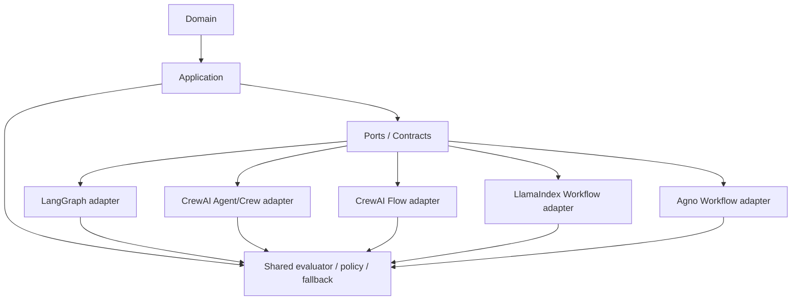
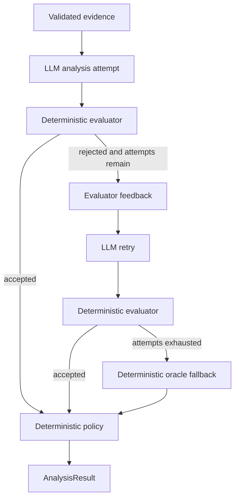

# Architecture and Security Model

This document describes the architecture of `agentic-security-framework-lab`, with emphasis on **authority boundaries** rather than framework features.

The central design rule is:

```text
LLM reasons
software validates
policy constrains
runtime executes
evidence explains
```

Frameworks are replaceable orchestration adapters. They do not own the security-sensitive truth of the system.

## 1. Architectural objective

The lab compares agentic frameworks without allowing framework choice to change the application security contract.

The same workload, evidence, expected truth, validator, bounded retry semantics, deterministic fallback, and human-review policy are reused across all implementations.



The framework is therefore below the application trust boundary.

## 2. Layer responsibilities

### Domain

`src/agentic_lab/domain/`

Owns security-domain concepts and deterministic rules such as:

- assets and installed software;
- CVE/vulnerability identity;
- version semantics;
- evidence representation;
- applicability states;
- security-relevant value objects.

The domain layer must not depend on application, adapters, or entrypoints.

### Application

`src/agentic_lab/application/`

Owns framework-neutral use-case contracts and controls, including:

- `AnalysisEvidenceBundle`;
- structured analysis contracts;
- shared prompt construction;
- deterministic applicability validation;
- evaluator feedback;
- bounded retry semantics;
- deterministic oracle fallback;
- human-review policy;
- final result construction.

The application layer must not depend on framework adapters.

### Adapters

`src/agentic_lab/adapters/`

Translate application contracts into framework-specific runtime behavior.

Current adapter families:

```text
adapters/
├── langchain/
├── langgraph/
├── crewai/
├── llamaindex/
└── agno/
```

Adapters may decide **how** reasoning is orchestrated, but not **what counts as valid** or **what the final policy decision is**.

### Benchmark scripts and artifacts

`scripts/` owns reproducible benchmark entrypoints and comparison generation.

`artifacts/benchmarks/` stores machine-readable and human-readable evidence from official benchmark runs.

Benchmark artifacts are evidence, not runtime configuration.

## 3. Authority model

The most important architectural distinction is who is allowed to decide what.

| Concern | Authority | LLM/framework allowed to decide? |
| --- | --- | --- |
| CVE identity | deterministic evidence/application contract | no |
| asset identity | input evidence | no |
| evidence provenance | deterministic evidence contract | no |
| proposed applicability reasoning | LLM | yes, probabilistic |
| whether proposed reasoning is valid | deterministic evaluator | no |
| whether another attempt is allowed | bounded retry policy | no |
| evaluator feedback content | deterministic application logic | no |
| deterministic fallback assessment | oracle | no |
| human-review requirement | deterministic policy | no |
| final `AnalysisResult` | application runtime | no |
| orchestration mechanics | framework adapter | yes |

This prevents the common failure mode where an LLM is asked to both reason about a control and authorize itself to pass that control.

## 4. Shared evidence boundary

Every framework consumes the same application-level bundle:

```text
AnalysisEvidenceBundle
├── vulnerability
├── assets
└── policy
```

Evidence identity is validated before probabilistic reasoning. A vulnerability bundle whose CVE identifier does not match the requested vulnerability is rejected fail-closed.

The evidence payload is treated as **data**, even when a field contains instruction-like text.

The `adversarial-asset-id` evaluation scenario exercises this narrow boundary by embedding instruction-like text in an asset identifier. It is not intended as a broad prompt-injection benchmark.

## 5. Prompt and structured-output boundary

Framework adapters reuse the shared application prompt contract instead of independently inventing security semantics.

Conceptually:

```text
system instructions
        +
application-built evidence prompt
        +
optional deterministic evaluator feedback
        │
        ▼
framework-specific structured LLM call
        │
        ▼
LLMAnalysisDraft
```

`LLMAnalysisDraft` is a proposal. Pydantic/structured parsing ensures shape, but **schema-valid does not mean security-valid**. The deterministic evaluator still checks the proposed applicability against external evidence and expected semantics.

## 6. Shared evaluator-optimizer runtime

The framework-neutral behavior is:



The official configuration allows at most two LLM analysis attempts.

A final correct result can therefore come from different runtime paths:

```text
LLM first-pass success
LLM retry recovery
oracle fallback
```

Benchmark telemetry preserves this distinction through fields such as:

- `analysis_source`;
- `validation_passed`;
- `analysis_attempts`;
- `model_calls`;
- retry/recovery/fallback rates.

## 7. Framework-specific orchestration

### LangGraph

Pattern: `evaluator_optimizer`

Uses explicit graph nodes and conditional routing. Structured model output is supplied through the LangChain model adapter.

Security authority remains in shared application validation and policy code.

### CrewAI Agent + Task + Crew

Pattern: `single_agent_external_evaluator_optimizer`

Uses native `Agent`, `Task`, and `Crew` abstractions for the reasoning call while the evaluator-optimizer remains external and deterministic.

This variant intentionally measures the prompt/orchestration envelope of the higher-level Crew abstraction.

### CrewAI Flow

Pattern: `flow_direct_llm_evaluator_optimizer`

Uses CrewAI Flow for routing/state with a direct structured LLM call instead of the `Agent + Task + Crew` envelope.

The official benchmark is headless so Rich console rendering is excluded from latency measurement.

### LlamaIndex Workflow

Pattern: `workflow_structured_predict_evaluator_optimizer`

Uses the standalone LlamaIndex Workflows event model and `structured_predict()` for structured reasoning.

The benchmark uses native async execution through one process-level event loop. Workflow state is carried through typed events for this phase; Context persistence/checkpoint serialization is intentionally not part of the benchmark surface.

### Agno Workflow

Pattern: `workflow_loop_condition_evaluator_optimizer`

Uses native Agno `Workflow`, `Loop`, `Step`, and `Condition` orchestration.

Benchmark-sensitive `Step` retries are explicitly disabled (`max_retries=0`) so the only valid retry path is the application-governed evaluator retry. Workflow telemetry is disabled for the controlled benchmark.

## 8. Hidden framework behavior as a security concern

A framework may introduce behavior that changes the meaning of a security benchmark even when application code looks equivalent.

Examples found during implementation include:

- implicit framework retries;
- framework telemetry;
- console rendering inside measured execution;
- SDK-specific sampling defaults;
- persistence/serialization surfaces;
- prompt envelopes added by higher-level agent abstractions.

The lab therefore treats framework defaults as part of the attack and measurement surface.

For benchmark-sensitive paths, defaults are either:

1. made explicit,
2. disabled when they would violate comparability, or
3. documented when they are a legitimate framework-specific difference.

## 9. Sampling policy

Official artifacts record provider-default sampling.

The exact SDK surface differs by implementation:

- LangGraph/LangChain and CrewAI effective requests use provider-default behavior;
- LlamaIndex materializes the provider-supported default temperature used by its OpenAI adapter;
- Agno leaves temperature unset and removes `None` request parameters.

The benchmark therefore must **not** be described as deterministic sampling. Repeated runs may differ legitimately in output wording, token count, first-pass acceptance, or retry behavior.

Determinism belongs to the validation and policy controls, not to the LLM sampler.

## 10. Telemetry model

Each benchmark run captures:

- model calls;
- analysis attempts;
- input tokens;
- output tokens;
- total tokens;
- latency;
- validation outcome;
- expected-truth match;
- retry/recovery/fallback path.

Telemetry is fail-closed where framework adapters expose incomplete usage accounting. Official artifacts are persisted only after structural invariants are validated.

Framework-specific telemetry mechanisms differ, but comparison artifacts normalize them into the same benchmark schema.

## 11. Evaluation truth boundary

Expected truth is external to every framework and model call.

The five current scenarios cover:

| Scenario | Security/evaluation property |
| --- | --- |
| `baseline-mixed` | affected and fixed assets in one request |
| `product-mismatch` | vulnerable product does not match installed product |
| `unknown-version` | uncertainty must remain uncertainty |
| `fixed-boundary` | exclusive version-boundary correctness |
| `adversarial-asset-id` | instruction-like text remains untrusted data |

This prevents a framework from defining its own success criteria.

## 12. Five-way benchmark architecture

All official variants share:

```text
same model
same 5 scenarios
same 3 repetitions/scenario
same expected truth
same deterministic evaluator
same bounded retry
same oracle fallback
same human-review policy
```

They intentionally differ in orchestration implementation.

The current consolidated evidence is stored in:

- `artifacts/benchmarks/comparison/five-way-latest.json`
- `artifacts/benchmarks/comparison/five-way-latest.md`

See [Framework Decision Matrix](FRAMEWORK_DECISION_MATRIX.md) for the engineering interpretation of those results.

## 13. Architecture boundaries enforced by engineering controls

The repository uses the shared engineering harness quality gate to enforce:

- dependency lock consistency;
- lint and formatting;
- architecture dependency rules;
- governance checks;
- strict Pyright typing;
- unit tests and coverage;
- Bandit static security analysis;
- dependency vulnerability auditing.

The intended dependency direction remains:

```text
Domain
  ↓
Application
  ↓
Ports / contracts
  ↓
Framework adapters / entrypoints
```

Forbidden directions include domain importing application/adapters/entrypoints and application importing adapters/entrypoints.

## 14. Non-goals

This repository is intentionally not a full vulnerability-management platform.

The benchmark does not require and therefore does not add generic:

- CVE ingestion pipelines;
- CPE matching services;
- cloud infrastructure;
- persistence databases;
- user interfaces;
- production APIs.

Those concerns would add uncontrolled variables without improving the framework comparison.

## 15. Design implication

The project is built around a replaceability test:

> If the orchestration framework is removed, do the security rules, evidence contracts, validation, fallback, and final authority still exist?

For the current architecture, the answer is yes.

That is the intended property: **agents may reason, but governed software decides.**
