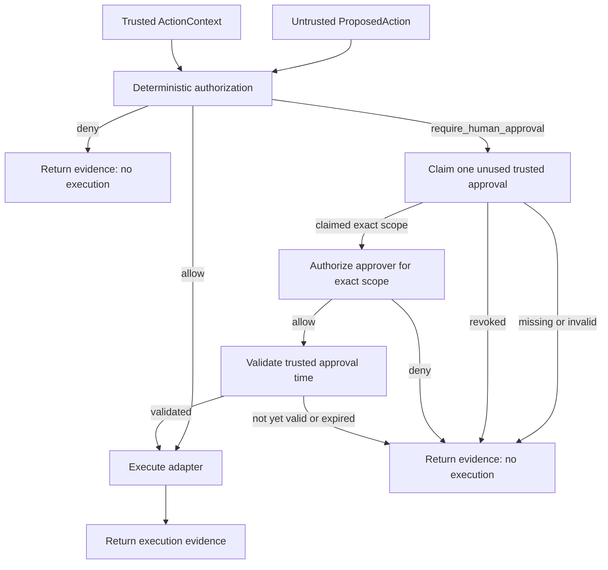

# Governed Agent Actions

This document describes the v1.1 security model for **mutable agent actions**, its v1.2 trusted-identity evolution, the v1.3 human-approval lifecycle hardening, and the post-v1.3 separation of approver entitlement in the Agentic Security Framework Lab.

The goal is not to make an agent "trusted." The goal is to let an agent propose an action while keeping caller authentication, identity provenance, authorization, human approval, runtime enforcement, and execution evidence outside the model and outside framework-specific orchestration logic.

The central rule is:

```text
agent/model proposes
trusted boundary establishes caller identity and provenance
policy authorizes
human evidence approves when required
approver policy authorizes the human for that exact scope
runtime enforces
adapter executes
execution evidence proves what happened
```

A schema-valid tool call is therefore still only a proposal.

## 1. Why this boundary exists

Agent frameworks and MCP make tools easy to expose. Exposure is not authority.

The lab distinguishes three independent questions:

```text
Is the tool available?
        !=
Is this caller authorized for this exact action scope?
        !=
Did execution actually occur?
```

Collapsing those questions creates a dangerous failure mode: a model discovers a tool, selects it, and is implicitly treated as authorized to execute it.

The governed-action boundary prevents that collapse.

## 2. Trust model

Two inputs are deliberately separated.

### Untrusted proposal

`ProposedAction` contains model-adjacent action intent:

```text
action
resource
environment
```

It is frozen, rejects extra fields, and carries no trusted identity, identity provenance, credential, or human-approval state.

### Trusted execution context

`ActionContext` contains:

```text
caller_id
identity_source
```

The caller context is supplied by trusted application/composition code. It is not accepted from `ProposedAction`, framework state controlled by the model, or MCP tool arguments.

The currently implemented identity sources are:

```text
trusted_composition
api_key
```

`trusted_composition` means local trusted composition code supplied the identity. It remains provenance evidence rather than authentication proof.

`api_key` means the controlled service-caller authenticator verified a configured synthetic API key before creating the context. It is an authentication source for a service/client identity in this lab; it is not end-user identity and is not a replacement for OAuth/OIDC on a sensitive remote API.

Unsupported identity-source values remain rejected. This prevents code from labeling an identity with an authentication mechanism that the repository does not implement.

The trust relationship is therefore:

```text
model intent != caller authentication != caller identity != authorization decision
```

### Service-caller authentication boundary

Phase 35 introduces a separate framework-neutral authentication contract:

```text
CallerCredential
       |
       v
CallerAuthenticator
       |
       +-- rejected ------> no ActionContext
       |
       +-- authenticated -> trusted ActionContext
```

`CallerCredential` wraps the opaque credential with Pydantic `SecretStr`, so routine representations and JSON serialization mask the raw value.

`CallerAuthenticationDecision` contains only:

```text
outcome
reason
context | none
```

It does not retain credential material. The contract rejects contradictory evidence such as `authenticated` without context or `rejected` with trusted context.

The first provider-free adapter is `StaticApiKeyCallerAuthenticator`. It is intentionally a controlled fixture:

- configured synthetic high-entropy API keys are reduced to SHA-256 digests during construction;
- trusted composition can instead provide precomputed SHA-256 verification material, avoiding retention of an expected plaintext key before construction;
- the adapter retains digests and caller ids rather than configured plaintext keys;
- presented digests are compared with `hmac.compare_digest()`;
- an unknown credential returns `rejected` and no `ActionContext`;
- a successful match returns `identity_source = api_key`.

This fixture demonstrates the authentication boundary without claiming production secret storage, rotation, throttling, transport binding, or end-user authentication.

### Authentication-first governed execution

Phase 36 composes authentication with the existing governed runtime through `AuthenticatedGovernedActionRuntime`.

The application receives the credential and action proposal as separate inputs:

```text
CallerCredential + ProposedAction
        |
        v
AuthenticatedGovernedActionRuntime
        |
        +-- authentication rejected
        |       -> no ActionContext
        |       -> no authorization call
        |       -> no mutable execution
        |
        +-- authentication succeeds
                -> derived ActionContext only
                -> GovernedActionRuntime
                -> authorization
                -> approval when required
                -> execution when permitted
```

The credential itself is not forwarded into `GovernedActionRuntime`, the authorizer, the approval provider, or the executor.

`AuthenticatedActionExecutionEvidence` keeps two facts separate:

```text
authentication
execution | none
```

Rejected authentication must have no action execution evidence. Successful authentication must pair action execution evidence with the exact `ActionContext` produced by authentication. This prevents evidence from silently substituting a different caller after credential verification.

Authentication success is therefore a precondition for authorization, not a permission grant.

## 3. Deterministic authorization

`StaticActionAuthorizationPolicy` is the current controlled-lab policy implementation.

Phase 37 makes trusted identity provenance part of the exact least-privilege key:

```text
(caller_id, identity_source, action, resource, environment)
```

A rule can produce one of three outcomes:

- `allow`
- `deny`
- `require_human_approval`

There are no wildcards, role inheritance, nearest-match rules, model-generated policy decisions, or source fallbacks in the current implementation.

If no exact rule exists, authorization fails closed with:

```text
outcome = deny
reason = no_matching_rule
```

This means changing only the caller, identity source, action, resource, or environment creates a different authorization request.

Authentication and authorization remain separate. A successfully verified API key establishes caller context, but that context carries `identity_source = api_key` and must match an explicit API-key-specific authorization rule. A rule for the same `caller_id` under `trusted_composition` does not grant authority to the API-key context.

The source-aware invariant is:

```text
same caller_id != same authority when identity_source differs
```

There is deliberately no compatibility fallback to the older four-field key. Missing source-specific policy remains an unknown scope and therefore fails closed.

## 4. Human approval is separate authority

`require_human_approval` is not equivalent to `allow`.

When policy requires approval, `GovernedActionRuntime` asks an `ActionApprovalProvider` to **claim** trusted `HumanApprovalEvidence`.

Approval evidence is bound to the exact action/context and a bounded validity window:

```text
ProposedAction + ActionContext + [approved_at, expires_at)
```

The runtime records one of these approval states:

- `not_applicable`
- `missing`
- `invalid`
- `unauthorized_approver`
- `not_yet_valid`
- `expired`
- `revoked`
- `validated`

Only exact-match approval evidence that is valid at trusted runtime time can become `validated` and release an approval-required action for execution.

The default provider is fail-closed and returns no approval. The in-memory approval provider used by tests contains only explicitly supplied synthetic evidence; it never auto-approves.

### Independent approver authorization

Trusted approval evidence and approver entitlement are separate facts. `HumanApprovalEvidence.approver_id` identifies the synthetic human principal recorded by the trusted HITL source, but that identifier does not grant global authority.

`ActionApproverAuthorizer` independently evaluates the exact scope:

```text
(approver_id, caller_id, identity_source, action, resource, environment)
```

The controlled static policy supports exact `allow` or `deny` only. Unknown scope and the default no-policy composition both fail closed. An approval from an unentitled approver is recorded as `unauthorized_approver`, produces zero side effects, and stays consumed because entitlement is evaluated after the single-use claim.

Approver authorization is evaluated only after exact approval binding and revocation checks, but before approval freshness and execution. Therefore direct caller `allow`, terminal caller `deny`, missing approval, invalid approval, and revoked approval do not depend on approver policy.

`ActionExecutionEvidence` keeps the approver decision separate from caller authorization and rejects contradictory evidence combinations. A temporal or `validated` approval state requires an explicit approver allow; `unauthorized_approver` requires an approver deny.

```text
trusted approval evidence != authorized approver
caller authorization != approver authorization
```

This is deterministic provider-free entitlement evidence. It does not implement or claim human authentication, OIDC/workforce IAM, directory-backed roles, signed approval attestations, self-approval policy, or multi-party/quorum approval.

### Approval anti-replay

Approval is modeled as a **single-use capability**, not a reusable boolean or lookup result.

`ActionApprovalProvider.claim_approval(...)` returns an explicit claim outcome: `missing`, `claimed`, or `revoked`. The controlled in-memory provider removes the matching queued capability when its claim position is encountered. A second identical request therefore receives `missing` unless a second, distinct human approval was supplied for that same scope.

The claim happens before the mutable executor runs. If the claimed evidence is invalid, or if the executor fails after the claim, the approval is not restored automatically. A retry requires fresh human approval.

This is deliberately fail-closed: a partially failed side effect must not make the same approval capability replayable.

The fixture rejects duplicate `approval_id` values and can hold multiple distinct approvals for the same exact scope when multiple executions were separately approved. This is process-local test evidence, not proof of durable or distributed transactional approval infrastructure.

### Approval identity-source isolation

Authorization already distinguishes trusted identity provenance through `(caller_id, identity_source, action, resource, environment)`. Approval lookup follows the same boundary: the controlled provider partitions queues by that exact five-field scope rather than by caller id and action scope alone.

This matters even though `GovernedActionRuntime` independently compares the complete claimed `ActionContext`. A four-field queue would still allow an approval-gated request under one source to dequeue an approval issued for another source, fail later as `invalid`, and consume the single-use capability before the intended caller could use it. Source-aware partitioning prevents that logical denial-of-service path before claim.

The runtime exact-context check remains as defense in depth. Provider partitioning prevents cross-source consumption; runtime validation prevents incorrectly returned evidence from becoming authority if a provider implementation is defective.

The adversarial regression configures both `trusted_composition` and `api_key` for the same caller/action/resource/environment as legitimately `require_human_approval`. The wrong-source attempt receives `missing` with zero side effects, while the original approval remains available and is validated exactly once under its intended source.

```text
same caller_id != same approval capability when identity_source differs
```

### Approval process-local concurrency safety

Sequential anti-replay is not enough when multiple agent/runtime attempts can race for the same single-use approval. The controlled in-memory provider therefore protects its source-aware queue and lifecycle dictionary with one process-local lock. Claim and revocation transitions are serialized together instead of relying on the Python GIL or incidental container-operation atomicity.

Barrier-coordinated tests prove eight simultaneous claims yield exactly one `claimed` and seven `missing` results. A concurrent claim-vs-revoke race permits only the two linearizable orderings: claim-first (`claimed` plus failed later revocation) or revoke-first (successful revocation plus a `revoked` claim). A direct runtime integration also proves eight concurrent approval-gated executions with one approval produce exactly one `validated` side effect.

```text
one approval capability + concurrent claims <= one claimed runtime attempt
```

This is a process-local guarantee for one provider instance. It does not prove cross-process/distributed locking, durable-store atomicity, or transactional coupling between approval consumption and an external side effect. Those require storage-specific coordination outside this controlled fixture.

### Approval freshness

Single-use prevents replay, but it does not by itself prevent stale authority. `HumanApprovalEvidence` therefore requires timezone-aware `approved_at` and `expires_at`, with `expires_at` strictly later than issuance.

`GovernedActionRuntime` owns freshness through an injected application `ApprovalClock`. The provider still owns only atomic claim semantics; frameworks, model output, and approval storage do not decide whether time is valid. The accepted interval is half-open: `approved_at <= trusted_now < expires_at`.

A claimed approval before its issuance becomes `not_yet_valid`; a claim at or after its expiry becomes `expired`. Neither executes. Both capabilities remain consumed, so retry requires new human evidence. A naive clock result is rejected fail-closed.

Tests use deterministic fixed clocks rather than sleeps. The adversarial suite proves that an old unused approval cannot authorize a late mutation, and the framework conformance matrix includes an expired-approval scenario across LangGraph, CrewAI, LlamaIndex, and Agno.

This proves local application-owned temporal enforcement, not distributed clock synchronization or production approval workflow infrastructure.

### Approval revocation

Freshness limits how long authority can live, but it does not let trusted control-plane code withdraw a still-valid approval before use. Phase 42 adds `ActionApprovalRevoker` as a separate trusted boundary for that lifecycle operation. Revocation is addressed by immutable `approval_id`; it is not a field in `ProposedAction` and is not controlled by an orchestration framework or model.

The controlled in-memory provider tracks each capability as `available`, `revoked`, or `claimed`. `revoke_approval(...)` succeeds only while the exact capability is still available. When a revoked capability reaches its queued claim position, the provider returns explicit `revoked` evidence, and `GovernedActionRuntime` blocks before freshness checks or mutable execution. A retry cannot reuse the revoked capability.

Revocation is intentionally not retroactive after claim. Once a runtime attempt has claimed the capability, later revocation returns false; cancellation of an already-running or externally coordinated side effect would require a different distributed control protocol. Revoking one approval id also leaves other distinct approvals for the same scope untouched.

Adversarial coverage proves a revoked, otherwise fresh production approval produces zero side effects, while cross-framework conformance proves direct runtime, LangGraph, CrewAI, LlamaIndex, and Agno preserve the same `revoked` result. This is provider-free process-local evidence, not durable or distributed revocation infrastructure.

## 5. Runtime enforcement

`GovernedActionRuntime` owns authorization, approval, and execution enforcement after trusted caller context exists:



When service-caller authentication is used, `AuthenticatedGovernedActionRuntime` sits before this runtime and supplies the context only after credential verification succeeds.

The executor is reached only after the application-owned control path permits it.

The runtime returns `ActionExecutionEvidence` containing independent facts about:

- the proposed action;
- trusted caller context, including caller identity provenance;
- authorization decision and reason;
- approval status, claim lifecycle, bounded approval evidence, approver-authorization decision, and temporal validity when present;
- whether execution occurred.

### Evidence state-machine integrity

`ActionExecutionEvidence` is treated as a constrained security state machine rather than an arbitrary bag of fields. The model rejects records that `GovernedActionRuntime` could never legally emit, even when evidence is reconstructed through deserialization, persistence, tests, or downstream audit tooling.

`AuthorizationDecision` likewise binds deterministic reason to outcome: `allow -> explicit_allow`, `require_human_approval -> human_approval_required`, and `deny -> explicit_deny | no_matching_rule`. This prevents a stored decision from claiming an allow outcome while carrying a deny reason.

The execution evidence validator enforces the complete runtime path:

- caller `deny` is terminal, uses `not_applicable`, carries no HITL evidence, and cannot record execution;
- direct caller `allow` uses `not_applicable`, carries no HITL evidence, and records direct execution;
- approval-gated `missing` carries no human or approver evidence and cannot execute;
- `invalid` requires human evidence whose action/context binding actually mismatches the attempted scope;
- `revoked` requires exact-bound human evidence, no approver decision, and no execution;
- `unauthorized_approver` requires exact-bound human evidence plus an approver deny and no execution;
- `not_yet_valid` and `expired` require exact-bound human evidence plus approver allow and no execution;
- `validated` requires exact-bound human evidence plus approver allow and is the only HITL state that records execution.

```text
deny + execution = impossible evidence
validated HITL + missing/mismatched authority = impossible evidence
```

This is structural consistency, not cryptographic integrity. The lab does not claim signed evidence, tamper-proof persistence, or transactional proof that an external side effect committed exactly as recorded.

### Executor failure evidence

An executor exception is not ordinary no-execution evidence. Once the runtime invokes an executor, a raised exception cannot establish whether an external system committed zero, partial, or complete effects before the failure became observable.

`GovernedActionRuntime` therefore raises `GovernedActionExecutionError` with separate immutable `ActionExecutionFailureEvidence` after an authorized executor call raises. The evidence preserves the exact authority that permitted the attempt and fixes these execution facts:

```text
execution_attempted = true
failure_reason = executor_error
external_side_effect_state = unknown
```

Direct-allow failure evidence carries no HITL fields. HITL failure evidence requires exact-bound `validated` human approval plus approver allow. Caller deny, missing/invalid/revoked approval, unauthorized approver, and temporal failures never synthesize executor-failure evidence because those paths stop before executor invocation.

The governed exception message is generic. The original exception is available only as the locally chained Python cause; raw executor text is not copied into structured failure evidence. A failed HITL attempt also leaves the already claimed approval consumed, so retry requires fresh approval.

```text
executor raised != external side effect did not occur
```

The lab does not claim rollback, compensation, automatic retry, idempotency, two-phase commit, or transactional coupling to an external system.

Because evidence embeds the same `ActionContext` used by authorization, the runtime does not create a second identity or provenance channel. Raw credentials are not part of `ActionContext`, `CallerAuthenticationDecision`, `ActionExecutionEvidence`, `ActionExecutionFailureEvidence`, or `AuthenticatedActionExecutionEvidence`.

This distinction matters because:

```text
authenticated != authorized != executed successfully
```

For example, a service credential can authenticate successfully while policy still denies the requested action because its exact identity source has no matching rule. Likewise, policy can authorize a scope while the concrete executor can still fail because the target resource does not exist.
 In that case the governed failure records that execution was attempted and keeps the external side-effect result `unknown` rather than misreporting a clean non-execution.

## 6. Safe mutable fixture

The controlled experiment uses `InMemoryFindingAcknowledgementExecutor`.

It exposes one synthetic mutable operation:

```text
acknowledge_finding
```

The fixture records observable acknowledgement state and a successful execution count. It also independently validates its own operation/resource invariants.

The fixture does **not** authorize the action. Authorization remains in the application layer.

Using an in-memory adapter keeps the experiment provider-free and prevents external side effects while still proving a real state transition.

## 7. Framework-neutral orchestration

The same `GovernedActionRuntime` is consumed by four orchestration frameworks.

| Framework | Orchestration primitive | Trusted context placement | Authorization owner |
| --- | --- | --- | --- |
| LangGraph | `StateGraph` node | injected outside graph input | Application |
| CrewAI | `Flow` + `@start()` | constructor dependency, outside Flow state | Application |
| LlamaIndex | `Workflow` + `StartEvent` / `StopEvent` | constructor dependency, outside event input | Application |
| Agno | `Workflow` + custom `Step` executor | injected dependency, outside workflow input | Application |

None of these adapters contains its own caller-authorization or approver-authorization rule table or interprets those outcomes to decide whether execution is permitted.

The framework orchestrates. The application decides and enforces.

Existing framework adapters continue to use their explicitly injected local `trusted_composition` context. Phase 37 migrates their caller-policy fixtures to declare that source explicitly, so framework behavior cannot depend on an implicit source default inside authorization policy. Phase 47 keeps approver entitlement in the same shared application runtime; cross-framework conformance includes an unauthorized-approver scenario rather than duplicating HITL policy inside LangGraph, CrewAI, LlamaIndex, or Agno. API-key handling remains an application authentication concern rather than framework input.

### Agno retry hardening

The Agno mutable step explicitly uses `max_retries=0` and fail-closed step behavior.

This is security-relevant because an implicit framework retry around a mutating executor could multiply side effects after a partial failure.

A regression test uses a failing executor and proves it is invoked exactly once.

## 8. Cross-framework conformance

The integration conformance suite treats direct `GovernedActionRuntime` execution as the behavioral baseline and compares it with LangGraph, CrewAI, LlamaIndex, and Agno.

The controlled matrix covers:

| Scenario | Expected result | Side effect |
| --- | --- | --- |
| exact allow | `allow` | exactly one mutation |
| explicit deny | `deny` | none |
| approval required, approval missing | `require_human_approval` / `missing` | none |
| approval required, trusted approval present | `require_human_approval` / `validated` | exactly one mutation |
| caller mismatch | fail-closed `deny` | none |
| identity-source mismatch | fail-closed `deny` | none |
| resource escalation | fail-closed `deny` | none |

For every framework, the suite compares:

- the complete `ActionExecutionEvidence` object;
- observable in-memory state;
- successful execution count.

The identity-source mismatch scenario uses the same allowed caller and action scope but changes only the trusted context from `trusted_composition` to `api_key`. Because no API-key-specific rule exists in that fixture, the direct runtime and all four framework adapters must return `deny / no_matching_rule` with zero side effects.

This is **provider-free cross-framework conformance evidence**. It does not prove production security, provider behavior, remote identity propagation, or statistical performance.

Relevant test:

- `tests/integration/test_governed_action_framework_conformance.py`

## 9. Adversarial boundary tests

Provider-free adversarial tests additionally exercise:

- escalation from a read-only caller to a mutable action;
- identity-source substitution for the same caller and action scope;
- resource and environment escalation;
- privileged caller spoofing inside the untrusted proposal;
- fake approval-like fields inside the proposal;
- repeated denied attempts;
- trusted approval replay after one successful mutable execution;
- tool/action substitution;
- unsafe proposals that must not imply unsafe side effects.

Identity tests additionally prove that model-adjacent proposals cannot smuggle `identity_source`, unsupported provenance values are rejected, an invalid service credential creates no trusted context, rejected authentication cannot reach authorization or mutable execution, and an API-key context does not inherit a trusted-composition rule.

Relevant tests:

- `tests/integration/test_adversarial_action_authorization.py`
- `tests/integration/test_governed_action_framework_conformance.py`
- `tests/unit/application/test_action_authorization.py`
- `tests/unit/application/test_action_identity.py`
- `tests/unit/application/test_authenticated_action_runtime.py`
- `tests/unit/adapters/test_service_caller_authenticator.py`

These tests validate the implemented authorization and authentication boundaries. They are not a claim of comprehensive prompt-injection, enterprise IAM, or authorization-system coverage.

## 10. MCP governed mutable action

The repository keeps the original read-only applicability MCP server and the governed mutable-action MCP server separate.

Project configuration exposes:

```text
agentic-security-applicability
agentic-security-governed-actions
```

The governed server exposes a mutable `acknowledge_finding` tool plus a separate read-only state tool used to observe the resulting side effect.

The mutable tool accepts only:

```text
resource
environment
```

The action name is fixed by the handler as `acknowledge_finding`, and the controlled local caller context is created by the server composition root as:

```text
caller_id       = local-mcp-host
identity_source = trusted_composition
```

The tool schema does not accept `caller_id`, `identity_source`, credentials, `approval_id`, or `approver_id`.

The current local policy binds every MCP rule explicitly to `identity_source = trusted_composition` and proves:

- exact `test` scope can execute;
- `staging` is explicitly denied;
- `production` requires approval and remains blocked because the local server does not configure an approval provider;
- resource substitution fails closed;
- another identity source cannot inherit the local composition rules.

The compatibility and real STDIO smoke checks verify both returned execution evidence, including trusted identity provenance, and independent observable state.

MCP tool annotations are treated only as behavioral metadata. They do not replace application authorization or runtime enforcement.

### Host-injected authenticated STDIO boundary

Phase 38 adds a separate provider-free MCP v2 STDIO server for authenticated governed actions. It is intentionally not registered in project `.codex/config.toml`: authentication material belongs to the trusted host/process environment rather than model-visible Tool arguments or checked-in server configuration.

The host supplies two separate values to the subprocess environment: a presented synthetic service credential and precomputed SHA-256 verification material. The server captures the presented credential, removes that raw value from the process environment, constructs `CallerCredential`, and invokes `AuthenticatedGovernedActionRuntime`.

The model-visible mutable Tool still accepts only:

```text
resource
environment
```

It cannot supply `credential`, `api_key`, `caller_id`, `identity_source`, `approval_id`, or `approver_id`. The authenticated context is created only after credential verification and carries:

```text
caller_id       = local-api-key-client
identity_source = api_key
```

The exact source-aware policy then independently decides the action. Real subprocess STDIO smoke coverage proves three isolated host cases:

- missing presented credential -> fail-closed Tool error and zero observable mutation;
- invalid presented credential -> `rejected / credential_rejected`, no execution evidence, and zero observable mutation;
- valid presented credential -> authentication succeeds, while `staging` is still denied, `production` still requires missing human approval, and only exact `test` scope executes.

A separate read-only state Tool verifies mutation independently after each path. Smoke credentials are generated at runtime, the expected plaintext credential is not committed, and the raw presented credential is not included in returned authentication, authorization, or execution evidence.

This proves local host-injected service authentication across a real MCP v2 STDIO subprocess. It does not prove remote MCP identity propagation, transport-bound authentication, OAuth/OIDC/JWT/mTLS, production secret management, or end-user identity.

## 11. What the current implementation does not claim

This lab intentionally does not yet implement a general enterprise authorization or identity platform.

Current non-goals include:

- RBAC/ABAC policy languages;
- wildcard or hierarchical resource scopes;
- identity-source wildcards or inheritance;
- authenticated end-user identity propagation;
- remote MCP OAuth authorization as proof of caller identity;
- federated identity or OIDC/JWT validation;
- password authentication;
- API-key rotation, expiry, throttling, or vault integration;
- transport-bound service authentication;
- durable approval workflows;
- approval expiry, revocation, or multi-party approval;
- distributed transactional atomicity between approval claims and external side effects;
- transactional rollback for external side effects;
- distributed idempotency keys;
- production audit storage;
- external policy engines such as OPA/Cedar;
- proof of production isolation or certification.

The current MCP `local-mcp-host` identity with `identity_source = trusted_composition` is a deployment-scoped local trust context for the experiment. It must not be described as authenticated user or agent identity.

The `api_key` source proves only a matching synthetic service credential in the controlled fixture. Phase 38 additionally proves local host-injected authentication across a real MCP v2 STDIO subprocess, while still making no claim of remote authenticated identity propagation or transport-bound authentication.

## 12. Security invariants

The implemented Governed Agent Actions boundary is designed around these invariants:

1. **A model can propose an action but cannot authorize itself.**
2. **Tool discovery does not grant execution authority.**
3. **Caller identity is trusted context, not model-controlled proposal data.**
4. **Identity provenance is trusted context and cannot be declared by the model.**
5. **Credential verification is separate from action authorization.**
6. **Failed authentication produces no trusted `ActionContext`.**
7. **Failed authentication cannot reach authorization, approval, or mutable execution.**
8. **Raw caller credentials do not enter authorization or execution evidence.**
9. **Authenticated execution must use the exact context established by authentication.**
10. **Authentication success never implies action authorization.**
11. **`trusted_composition` provenance is not authentication proof.**
12. **`api_key` identifies only the controlled service credential mechanism.**
13. **Authorization binds to exact caller identity provenance as well as action scope.**
14. **The same `caller_id` does not inherit authority across identity sources.**
15. **Unknown or source-mismatched authorization scopes fail closed.**
16. **Human approval is separate trusted evidence, not a prompt field.**
17. **Approval is bound to one exact caller context and action scope.**
18. **One claimed approval cannot be replayed for a second mutable execution.**
19. **A retry after a claimed approval requires fresh human evidence.**
20. **Framework adapters do not own policy or enforcement.**
21. **A denied or unapproved action must not reach the mutable executor.**
22. **Execution evidence is distinct from authorization evidence.**
23. **Framework-specific retries must not silently multiply mutable side effects.**
24. **Host credential material is separate from model-controlled MCP Tool input.**
25. **Missing or rejected host authentication cannot produce mutable side effects.**
26. **Local STDIO host injection must not be described as remote or transport-bound authentication.**

## 13. How to explain this in an interview

A concise explanation is:

> "Once I had two trusted identity sources, caller ID alone stopped being a sufficient authorization key. I kept authentication separate: a credential first derives a trusted `ActionContext`, then authorization matches the exact caller, identity source, action, resource, and environment. There is no cross-source fallback, so an API-key-authenticated caller does not inherit authority granted to the same caller ID under local trusted composition. At the MCP boundary, the host injects credential material outside the Tool schema, so the model still proposes only action scope. Failed authentication never reaches policy, successful authentication can still be denied, human approval remains a separate authority, and the same runtime semantics hold across LangGraph, CrewAI, LlamaIndex, Agno, and MCP."

The important architectural point is not the specific in-memory action or synthetic credential. It is that **authentication, identity provenance, authorization, approval, and execution are independent control points rather than one model-controlled tool call**.
